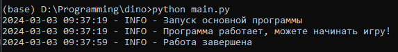

# Chrome-Dino Autoplay

Chrome-Dino Autoplay - программа, которая автоматически играет за вас в знаменитого динозаврика в браузере Google Chrome.

 
## Запуск программы

1. **Установка библиотек:**
   - Установите необходимые библиотеки, используя файл `requirements.txt`.
   
   Примечание: Установите библиотеку PyTorch вручную, используя следующую ссылку: [PyTorch](https://pytorch.org/get-started/locally/)
  
2. **Клонирование репозитория:**
   - Клонируйте репозиторий на свой компьютер.

3. **Запуск из командной строки:**
   - Откройте командную строку в корневой папке проекта.
   - Выполните команду:
     ```bash
     python main.py
     ```

4. **Открытие Google Chrome:**
   - Откройте браузер Google Chrome.
   - Введите в адресной строке `chrome://dino/`.

5. **Старт программы:**
   - Как только увидите сообщение `Программа работает, можете начинать игру!`, запустите игру с динозавриком.

6. **Наблюдение за игрой:**
   - Наслаждайтесь автоматизированным игровым процессом!

7. **Остановка программы:**
   - Для завершения программы нажмите клавишу `q`.

Теперь ваш динозаврик готов к автоматизированному веселью! 🦕🎮

## Скриншот терминала
 

## Особенности программы
- *Автоматические действия:*
  - Программа реагирует на визуальные сигналы в игре, выполняя автоматические прыжки при обнаружении кактуса и приседания при появлении птицы. Это гарантирует безопасное и эффективное взаимодействие с игровым окружением.

- *Использование YOLOv8:*
  - Программа внедряет обученную модель YOLOv8 для обнаружения объектов в игре. Этот подход делает программу адаптивной и способной распознавать различные элементы игры.

- *Легкость использования:*
  - Просто запустите скрипт в командной строке, и программа автоматически управляет динозавриком. Это превращает игровой процесс в удовольствие без лишних хлопот.

- *Интеграция машинного обучения:*
  - Использование YOLOv8 подчеркивает интеграцию машинного обучения. Программа обнаруживает объекты в реальном времени, что придает ей инновационный характер.

- *Практичность:*
  - AutoDino предоставляет простой способ автоматизировать игровой процесс. Это особенно полезно для тестирования, разработки или просто для приятного времяпрепровождения.

## Личный рекорд
Динозаврик не всегда идеален, поэтому иногда он ошибается. Его личный рекорд в беге составляет 10539, что является довольно большой цифрой, по сравнению с моими личными результатами, когда я пробегал от 1000 до 1500.

 

  